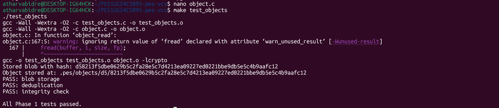
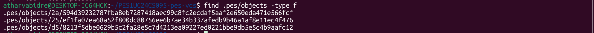
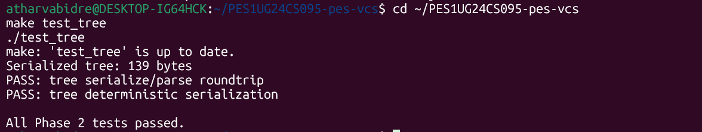
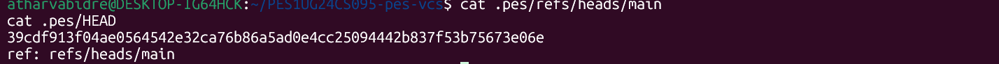
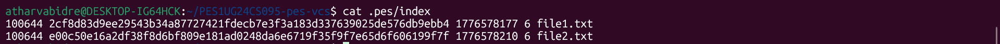
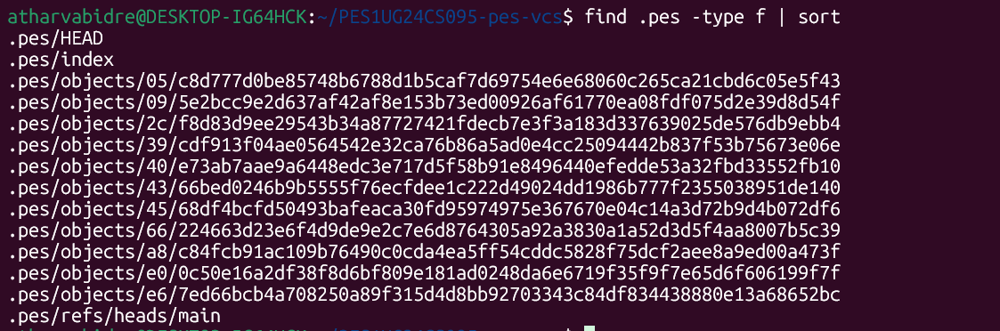
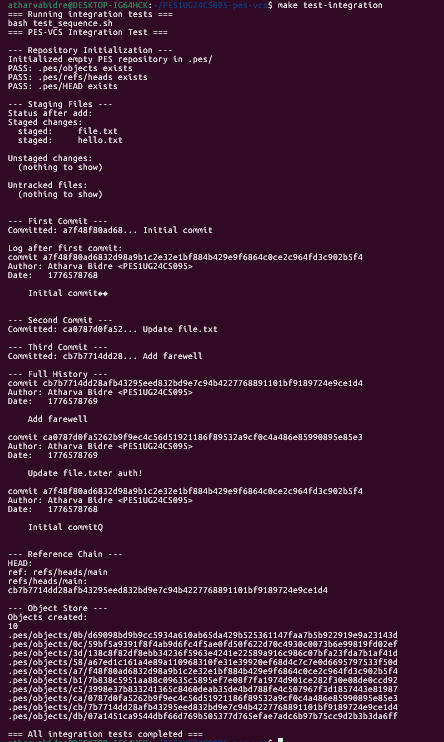

# PES-VCS Lab Report
**Name:** Atharva Bidre  
**SRN:** PES1UG24CS095

---

## Phase 1 — Object Storage

### Screenshot 1A — test_objects passing

### Screenshot 1B — Sharded object store

---

## Phase 2 — Tree Objects

### Screenshot 2A — test_tree passing

### Screenshot 2B — xxd of tree object

---

## Phase 3 — Index / Staging Area

### Screenshot 3A — init, add, status

### Screenshot 3B — cat .pes/index

---

## Phase 4 — Commits and History

### Screenshot 4A — pes log

### Screenshot 4B — find .pes -type f

### Screenshot 4C — HEAD and refs

---

## Final Integration Test

---

## Phase 5 — Branching Analysis

### Q5.1
What files change in .pes/:
HEAD is the only file that needs to change. You update it to point to the new branch:
ref: refs/heads/<new-branch>
What must happen to the working directory:

Read the current HEAD → get current commit hash → get current tree
Read the target branch → get target commit hash → get target tree
Compare the two trees — find files that are different between them
For each file that differs:

If the file exists in the target tree → write the target version to disk
If the file doesn't exist in the target tree → delete it from disk

Update the index to match the target tree exactly
Update HEAD to point to the new branch

What makes it complex:

You have to update both the working directory files and the index atomically — if it crashes halfway, the repo is in a broken state
You must handle subdirectories — creating and deleting entire folder trees if needed
If a file was added in the working directory but doesn't exist in either branch (untracked), you must leave it alone
If the file exists in both branches but has different content, you must decide which version wins — and if the user has local edits, this becomes a conflict

### Q5.2

When switching branches, you need to check if any file would be overwritten with local unsaved changes. Here's how using only the index and object store:
Step by step:

For each file in the current index, compute the hash of the file currently on disk (same way pes add would)
Compare that hash to what the index says the hash should be
If they differ → the file is locally modified (dirty)
Now check: does this dirty file also differ between the two branches?

If yes → refuse checkout, print an error like:

     error: Your local changes would be overwritten by checkout:
         hello.txt
     Please commit or stash your changes before switching branches.

If no → the file is the same on both branches, so the local change is safe and checkout can proceed

Why this works: The index always stores the hash of the last staged/committed version. Comparing the on-disk hash to the index hash is exactly how pes status detects unstaged changes — the same logic applies here.

### Q5.3
What it is:
Normally, HEAD contains a branch reference like:
ref: refs/heads/main
In detached HEAD, HEAD directly contains a commit hash like:
39cdf913f04ae0564542e32ca76b86a5ad0e4cc2...
What happens if you make commits in this state:
New commits are created and chained correctly — each new commit points to the previous one as its parent. BUT since HEAD points directly to a hash and not a branch, no branch file gets updated. The commits exist in the object store but nothing points to them by name.
When you checkout another branch, HEAD changes, and those commits become unreachable — no branch, no tag, nothing points to them. They will eventually be deleted by garbage collection.
How to recover:
You need to create a branch pointing to those commits before you leave. If you're still in detached HEAD state:
bashpes branch recovery-branch   # create branch at current HEAD
pes checkout recovery-branch  # now HEAD points to branch, commits are safe
If you already left and lost track of the hash, you'd have to search through all objects in .pes/objects/ manually to find the commits — which is why Git has a reflog (a log of every position HEAD has been at). PES-VCS doesn't implement reflog, so losing commits in detached HEAD is permanent once GC runs.
---

## Phase 6 — Garbage Collection Analysis

### Q6.1
Phase 1: MARK (find all reachable objects)
Start from every branch reference and walk the entire history:
reachable = empty set

for each file in .pes/refs/heads/:
    start_hash = read that file
    walk_commit(start_hash, reachable)

walk_commit(hash, reachable):
    if hash already in reachable → stop (already visited)
    add hash to reachable
    
    commit = read and parse .pes/objects/XX/YYY...
    add commit.tree_hash to reachable
    walk_tree(commit.tree_hash, reachable)
    
    if commit has parent:
        walk_commit(commit.parent_hash, reachable)

walk_tree(hash, reachable):
    if hash already in reachable → stop
    add hash to reachable
    
    tree = parse tree object
    for each entry in tree:
        add entry.hash to reachable
        if entry is a subtree:
            walk_tree(entry.hash, reachable)
        # blobs are just added, no further walking needed
Phase 2: SWEEP (delete unreachable objects)
for each file in .pes/objects/**/*:
    hash = reconstruct hash from directory + filename
    if hash NOT in reachable set:
        delete the file
Data structure: A hash set (like a C uthash or Python set) — O(1) lookup for "is this hash already marked?"
Estimate for 100,000 commits and 50 branches:
Each commit has: 1 commit object + 1 root tree + roughly 10 blob/tree objects on average = ~12 objects per commit.
Total objects to visit = 100,000 × 12 = ~1.2 million objects. With a hash set, each lookup is O(1), so the full mark phase is O(1.2 million) — fast enough to run in seconds.

### Q6.2

The race condition:
Imagine GC and a commit running at the exact same time:
TIME →

GC Thread:                          Commit Thread:
──────────────────────────────────────────────────
1. Scans all reachable objects
   (marks everything reachable)
                                    2. Writes new blob to object store
                                       (blob exists on disk but nothing
                                        points to it yet)
3. Sweeps — sees the new blob,
   it's not in the reachable set
   → DELETES IT                     
                                    4. Writes tree that references
                                       the blob → TREE POINTS TO
                                       A DELETED OBJECT 💥
                                    
                                    5. Writes commit pointing to tree
                                    6. Updates HEAD → repo is now corrupt
The problem: GC's mark phase completed before the blob was written, so the blob was never marked reachable. Then GC deleted it. Now the commit references a blob that doesn't exist.
How Git avoids this:

Grace period: Git's GC never deletes objects newer than 2 weeks old by default. Since the entire commit operation takes milliseconds, a 2-week grace period makes the race essentially impossible in practice.
Lock files: Git uses .git/index.lock and similar lock files to signal that a write operation is in progress. GC checks for these locks and refuses to run if any are present.
Write ordering: Git always writes objects bottom-up (blobs first, then trees, then commits) and only updates the branch ref last. GC starts from refs and walks down. If the ref hasn't been updated yet, GC won't reach the new objects — they're temporarily unreachable but GC won't delete them because of the grace period.
